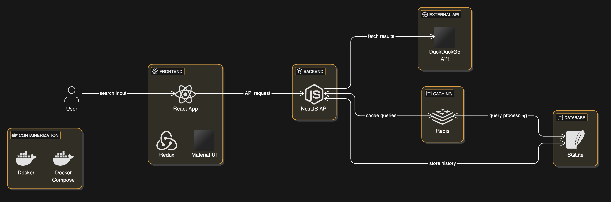

<h1 align="center">🐥 Search360</h1>

<p align="center">
  <a href="#-running">Running</a>&nbsp;&nbsp;&nbsp;|&nbsp;&nbsp;&nbsp;
  <a href="#-technologies">Technologies</a>&nbsp;&nbsp;&nbsp;|&nbsp;&nbsp;&nbsp;
  <a href="#-license">License</a>
</p>

<p align="center">
  <a href="#-license">
    
  </a>
</p>

<p align="center">
  
</p>

<p align="center">
Search360 is a full-stack web application that enables users to search the web using DuckDuckGo and stores query history. The project includes pagination, search highlighting, and persistent query history with caching for improved performance.
</p>

## 🚀 Features

✅ **Search using DuckDuckGo API**  
✅ **Fast & efficient caching with Redis**  
✅ **Search highlighting** (like Chrome’s Find feature)  
✅ **Persistent query history stored in SQLite**  
✅ **Built with React, Redux, NestJS, SQLite, and Redis**

## 📈 System Design Overview

<p align="center">
  
</p>

## 💻 **Running**

### **Requirements**

- `docker`
- `node >= 20`

#### 1️⃣ Clone the Repository

```bash
git clone https://github.com/arthursvpb/search360.git
cd search360
```

#### 2️⃣ Set Up Environment Variables

Copy the `.env.example` file to a `.env` in the `api` folder.

#### 3️⃣ Start the Application

```bash
# Run the back-end
cd ./api && npm run docker:start # docker:reset for a clean start-up
# Go back to the root folder
cd ..
# Run the front-end
cd ./www && npm install && npm run dev
```

- **Frontend:** Runs on `http://localhost:5173/`
- **Backend:** Runs on `http://localhost:3000/`

## ⚡ **Caching with Redis**

To improve performance, **Redis is used for query caching**:

- **Search queries are cached** to prevent redundant API calls.
- **Past queries are stored in Redis** and reloaded instantly when the application restarts.

### **Clear Cache Manually**

Run the following command:

```bash
docker exec -it redis redis-cli FLUSHALL
```

This will **reset all cached queries**.

## 🛠️ **API Endpoints**

### **🔎 Search**

Supports both **GET** and **POST** requests.

#### **`GET /search?q=your-query`**

#### **`POST /search`**

```json
{
  "q": "your-query"
}
```

#### **Response (Same for Both Methods)**

```json
{
  "results": [
    {
      "title": "Example Title",
      "url": "https://example.com"
    }
  ]
}
```

### 📜 **Query History**

`GET /history`

```json
{
  "history": [
    {
      "id": 1,
      "searchTerm": "example query",
      "createdAt": "2025-02-21T12:34:56.789Z"
    },
    {
      "id": 2,
      "searchTerm": "another query",
      "createdAt": "2025-02-21T12:30:00.123Z"
    }
  ]
}
```

## ✨ **Technologies**

- **Frontend:** React, Redux, Material UI
- **Backend:** NestJS, SQLite, Redis
- **API:** DuckDuckGo
- **Containerization:** Docker

## 📝 **License**

This project is under the MIT license. See the [LICENSE](LICENSE) file for more details.
